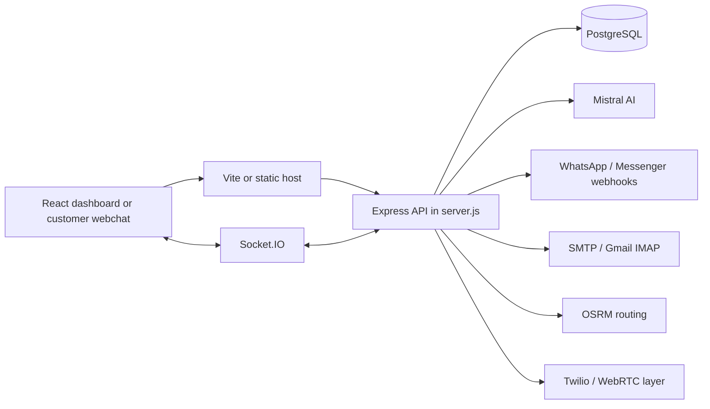
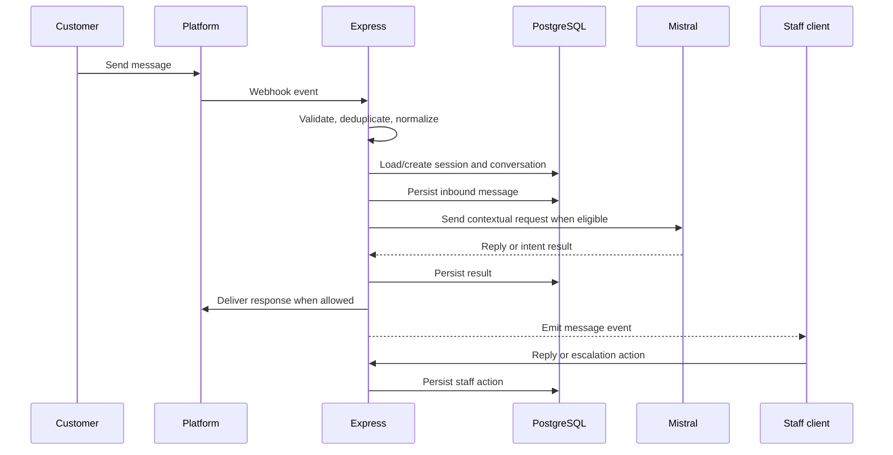

# LiveSupport Project – Detailed Architecture and Explanation

## 1. What this project is

This project is a full-stack customer support and operations platform for a restaurant or food service business. It is not just a chat app. It combines:

- live customer messaging across multiple channels
- AI-generated support replies
- staff inbox management
- order intake and confirmation
- vouchers and discounts
- refunds and ticketing
- delivery tracking and ETA estimation
- voice calling support and staff presence
- authentication and admin dashboards

In short, it is a business operations console with a conversational layer at the center.

The core runtime files are:

- [server.js](server.js)
- [src/App.jsx](src/App.jsx)
- [src/pages/InboxPage.jsx](src/pages/InboxPage.jsx)
- [replies.js](replies.js)
- [prisma/schema.prisma](prisma/schema.prisma)
- [db/database-prisma.js](db/database-prisma.js)
- [routes/auth.js](routes/auth.js)
- [package.json](package.json)

---

## 2. Tech stack overview

### Frontend

- React 19
- Vite
- Tailwind CSS
- React Router
- Socket.IO client
- Lucide icons
- custom UI components

The frontend entry point is:

- [src/main.jsx](src/main.jsx)
- [src/App.jsx](src/App.jsx)

The styling is configured in:

- [tailwind.config.js](tailwind.config.js)
- [src/index.css](src/index.css)

### Backend

- Node.js
- Express 5
- Socket.IO
- PostgreSQL
- Prisma ORM
- pg native driver
- dotenv
- multer for file uploads

Main backend entry point:

- [server.js](server.js)

### Database

- PostgreSQL
- Prisma schema for modeling tables
- raw SQL fallback utilities for compatibility

Schema:

- [prisma/schema.prisma](prisma/schema.prisma)

Database bridge:

- [db/database-prisma.js](db/database-prisma.js)

### AI / external services

- Mistral AI via REST API
- Gmail/IMAP utilities
- email sending via nodemailer
- Twilio for calls/SMS support
- OSRM for routing and ETA calculations

### Real-time support

- Socket.IO for inbox updates, presence, call events, live dashboards

---

## 3. File and folder structure meaning

### Root-level setup files

- [package.json](package.json): defines scripts, dependencies, and build commands
- [vite.config.js](vite.config.js): frontend dev server and API proxy configuration
- [server.js](server.js): main backend server
- [prisma/schema.prisma](prisma/schema.prisma): data model
- [README.md](README.md): overall project notes

### src folder

This is the React frontend. It contains all dashboard pages and reusable UI pieces:

- [src/App.jsx](src/App.jsx): router and app shell
- [src/pages](src/pages): all major pages such as inbox, orders, dashboard, settings, etc.
- [src/components](src/components): UI widgets like notification banners, live call header, sidebar, status badges
- [src/contexts](src/contexts): React context providers for notifications, voice, sidebars, etc.
- [src/services](src/services): API and support services
- [src/utils](src/utils): helper functions for formatting, validation, safe app logic

### routes folder

- [routes/auth.js](routes/auth.js): authentication and reset flows

### services folder

This folder contains operational backend logic:

- [services/deliveryTrackingService.js](services/deliveryTrackingService.js): delivery route and rider state
- [services/notificationService.js](services/notificationService.js): notifications to staff users
- [services/osrmService.js](services/osrmService.js): route distance/ETA logic
- [services/platformConversationService.js](services/platformConversationService.js): inbox conversation normalization for multiple channels

### utils folder

This is where the project keeps reusable business logic and conversation intelligence:

- order reasoning
- AI conversation flow
- branch detection
- voucher validation
- delivery sync
- customer web chat state handling
- high-risk intent detection

### sockets folder

- [sockets/deliverySocket.js](sockets/deliverySocket.js): real-time delivery-specific broadcast logic

---

## 4. How the app is built

### Frontend build model

The frontend is a Vite React SPA. It is served locally on port 3001, while the backend runs on a different port and is proxied.

This is defined in [vite.config.js](vite.config.js):

- frontend dev server on 3001
- API requests to `/api`, `/login`, `/logout`, `/webhook`, `/auth` are proxied to the backend server
- WebSocket traffic for socket.io is proxied with `ws: true`

This design makes local development easy: the React app behaves like a client app while still talking to a Node backend.

### Backend build model

The backend is a single Express app launched from [server.js](server.js). It attaches:

- sessions
- route handlers
- database initialization
- Socket.IO server
- static file serving
- middleware for uploads and request parsing

It also initializes core behavior such as:

- notifications table setup
- AI config
- branch/session creation support
- delivery and voice state maps

This file acts like the main controller of the application.

---

## 5. Database structure and why it matters

The database schema in [prisma/schema.prisma](prisma/schema.prisma) shows this application is designed around multiple business entities.

### Main entities

#### Branch
Represents restaurant or support branches.

- id
- name
- address
- latitude/longitude
- active/archive state
- relations to users, customers, conversations, orders, menus, staff profiles

#### Staff
Represents internal staff members or agents.

- email
- name
- password
- role
- branch

#### Conversation
This is the central table for customer interaction.

- phone
- name
- platform
- platform_user_id
- status
- assigned_staff_id
- last_message_at
- branch_id
- order_id
- customer_id

This table is the heart of the support system.

#### ChatSession
This preserves temporary pending customer interactions, especially when the user is in a branch-selection or onboarding state.

- platform
- platform_user_id
- state
- pending_messages
- expires_at

#### Message / Reply / AiMessage / StaffMessage
These tables allow the platform to record who said what and in what context.

- customer inputs
- staff replies
- AI replies
- system messages

#### Escalation and Resolved
Used for customer escalation and issue closure workflows.

#### Refunds
Tracks refund requests, approvals, and delivery progress.

#### Orders and menus
The schema includes models for orders and branch menus, indicating a deeper commerce layer than simple support.

### Why the DB design is important

It shows the app was designed to support:

- multi-branch operations
- user roles and staff assignment
- ticketing and support lifecycle
- order history
- escalation and resolution tracking
- customer communication history

---

## 6. Real-time lifecycle in the inbox

The live inbox implementation is in [src/pages/InboxPage.jsx](src/pages/InboxPage.jsx), and it demonstrates how modern the project is.

### On load

The page does the following:

- fetches `/api/conversations`
- normalizes the returned list
- selects the first conversation by default
- fetches `/api/messages/:conversationId` for the selected thread
- sets up a Socket.IO connection

### Real-time updates

When a message arrives:

- the server emits a message event
- the frontend detects if it belongs to the active conversation
- if not active, it updates unread count
- if active, it updates the current thread immediately
- it refreshes conversation list in the sidebar

This keeps the dashboard feeling live and responsive.

### Autopilot mode

The app also tracks a local user setting called `autopilotMode`, and emits it to the backend:

- `agent:updateAutopilotMode`

This means AI automation can be toggled or adjusted per agent session.

---

## 7. AI integration: how the assistant works

The AI integration is centralized in [replies.js](replies.js).

### AI configuration

The file defines:

- `resolveAiRequestConfig()`
- model selection
- timeout settings
- token limits

This gives the app a controlled AI layer instead of a loose freeform conversation.

### Knowledge base and canned responses

The AI loads:

- `knowledge-base.json`
- `canned-responses.json` if present

The project watches those files for changes and reloads them automatically. This is a useful production pattern for business content updates without restarting the server.

### Mistral API call model

The app connects to:

- `https://api.mistral.ai/v1/chat/completions`

It sends tasks like:

- respond to a customer
- answer menu questions
- detect intent
- evaluate issue severity
- create support ticket or escalation

### Fallback behavior

If AI fails, the app falls back to a human-safe message such as:

> Sorry, I’m having trouble processing that right now.

That is very important because support apps cannot break when external AI services fail.

### AI business logic

The AI layer is not generic. It is tailored to this app’s domain:

- menu suggestions
- delivery fee information
- order confirmation style
- restaurant support context
- ticket creation and escalation detection

This is the key reason the project is more than a generic chatbot.

---

## 8. Customer contact channels

The project is designed for multiple digital customer channels.

### WhatsApp
Support chats can come in through WhatsApp-style messaging logic. The app stores `platform` and `platform_user_id` to differentiate channels.

### Messenger
The inbox labels Messenger separately and the platform-specific UI is designed around it.

### Webchat
A customer chat UI exists, including onboarding pages:

- [src/pages/CustomerWebChatPage.jsx](src/pages/CustomerWebChatPage.jsx)
- [src/pages/CustomerChatOnboardingPage.jsx](src/pages/CustomerChatOnboardingPage.jsx)

This means the app supports embedded customer chat as well as social channels.

### Unified inbox
The inbox page supports a unified conversation list, while the platform-specific dashboard logic is still preserved.

---

## 9. Orders and commerce logic

The project includes serious order-handling code. The menu and pricing logic is built into [replies.js](replies.js), with supporting modules such as:

- [utils/orderPipeline.js](utils/orderPipeline.js)
- [src/services/ordersService.js](src/services/ordersService.js)
- [src/pages/OrdersPage.jsx](src/pages/OrdersPage.jsx)

### What it can do

- match order items to menu catalog
- calculate cart totals
- apply delivery fees
- check order thresholds
- confirm/quote orders
- support menu and item lookup with natural language

### Example workflow

Customer writes: “I want a large pizza and burger.”

The AI logic tries to:

- detect items
- match to menu catalog
- calculate price
- create an order summary
- ask follow-up questions if needed
- confirm final order

This is why the app blends support and commerce in one system.

---

## 10. Vouchers, discounts, and refunds

The project contains voucher support:

- [utils/voucherStorage.js](utils/voucherStorage.js)
- [utils/voucherValidation.js](utils/voucherValidation.js)
- [src/pages/VouchersPage.jsx](src/pages/VouchersPage.jsx)

### Functionality includes

- list vouchers
- add/create voucher records
- update or delete vouchers
- validate voucher codes
- apply discounts to orders
- redeem vouchers for orders
- calculate discount stats

This is part of the business logic used when customers request coupons or special offers.

Refunds are treated as a separate operational domain with dedicated schema and UI support.

---

## 11. Delivery and routing

This app really has a delivery engine.

### Delivery logic modules

- [services/deliveryTrackingService.js](services/deliveryTrackingService.js)
- [sockets/deliverySocket.js](sockets/deliverySocket.js)
- [services/osrmService.js](services/osrmService.js)
- [utils/deliveryOrderSync.js](utils/deliveryOrderSync.js)

### What it does

- tracks rider location
- updates route and ETA
- calculates distance between points
- syncs delivery state with order/state context
- publishes updates over live sockets

This clearly indicates the system was designed for a food delivery platform or support center attached to a delivery operation.

---

## 12. Authentication and staff account systems

The auth flow is in [routes/auth.js](routes/auth.js). It includes:

- password reset requests
- token generation
- rate limiting
- secure password reset UI flow
- email notifications after password changes

This means the app expects a real staff user system with durable credentials and secure resets.

---

## 14. Notification and escalation systems

The project has built-in escalation infrastructure for customer issues.

### Escalation features

- high-risk intent detection
- alerting when something needs human review
- snoozed escalations
- claimed escalations
- assigned staff logic

The server tracks:

- agent activity maps
- escalation timers
- typing indicators
- presence data

This supports a real-time support desk model.

---

## 15. What the main server does at runtime

When the server starts, [server.js](server.js) does a lot of setup:

- establishes DB connections
- validates environment variables
- loads AI configuration
- ensures support tables exist
- creates default voice channels
- starts Socket.IO
- begins listening for incoming webhooks and chat events

This file effectively acts as the central orchestrator for the whole app.

---

## 16. Typical request flow from a customer message to support response

Here is the real flow:

1. A customer sends a message via WhatsApp, Messenger, or webchat.
2. A webhook or platform handler receives it.
3. The backend checks whether a conversation already exists.
4. It saves the message to the database.
5. It normalizes state and branch context.
6. It checks whether this is a branch-selection request, order request, high-risk intent, or standard conversation.
7. The AI module evaluates the message.
8. It may:
   - answer directly
   - ask a clarification question
   - trigger an order flow
   - detect escalation risk
   - create a ticket
9. The response is sent back to the customer.
10. The frontend inbox updates in real time.
11. A staff agent can intervene if needed.

This is the central workflow of the app.

---

## 17. Why this project is impressive

This project is not a toy or a simple UI prototype. It is a complete operational support platform with:

- real-time messaging
- branch support logic
- AI support integration
- order and menu flows
- customer service workflows
- delivery tracking
- ticketing and escalation
- voice support
- staff auth and dashboarding

The design shows a thoughtful architecture: domain logic is split across modules, UI screens are separate, and the backend orchestrates multiple business systems.

---

## 18. Best files to read next

If you want to understand the app deeply, read these in order:

1. [server.js](server.js)
2. [src/pages/InboxPage.jsx](src/pages/InboxPage.jsx)
3. [replies.js](replies.js)
4. [prisma/schema.prisma](prisma/schema.prisma)
5. [db/database-prisma.js](db/database-prisma.js)
6. [routes/auth.js](routes/auth.js)
7. [services/platformConversationService.js](services/platformConversationService.js)
8. [services/deliveryTrackingService.js](services/deliveryTrackingService.js)
9. [src/App.jsx](src/App.jsx)
10. [package.json](package.json)

---

## 19. Final summary

This project was built as a smart customer support and operations system for a food business. It combines the following layers:

- customer communication layer
- AI assistant layer
- operations dashboard layer
- order and voucher commerce layer
- delivery and logistics layer
- staff auth and management layer
- voice communication layer

It is a highly integrated system designed to run like a real support and operations center, not just a frontend demo.

If you want, the next level can be:

- a deeper “flow-by-flow” explanation of how a customer message moves from webhook to AI to response,
- a code-by-code breakdown of the most important modules,
- or a PDF-style export version of this document.

---

# Technical Developer Architecture Report

## 20. System boundaries and runtime topology

The application has two primary runtime processes during development:

1. Vite serves the React single-page application on port `3001`.
2. Node runs the Express and Socket.IO backend, normally on port `3000`.

[vite.config.js](vite.config.js) proxies browser requests for `/api`, `/auth`, `/login`, `/logout`, `/webhook`, and `/socket.io` to the backend. The Socket.IO proxy has WebSocket forwarding enabled, which is required for live inbox and call events.

The system can be represented as:



## 21. Application bootstrap

[server.js](server.js) is the backend composition root. It imports the database adapter, AI module, authentication router, conversation services, delivery services, notification services, and domain utilities.

Startup responsibilities include:

- loading environment variables with `dotenv`
- creating the Express application
- trusting the proxy for deployments behind a tunnel or reverse proxy
- configuring file uploads through `multer`
- initializing the database used by raw-SQL helpers
- validating environment variables
- ensuring notification and branch-selection tables exist
- creating the HTTP server and attaching Socket.IO
- registering REST endpoints, webhook routes, and socket event handlers

The backend also initializes process-local maps for agent presence, active calls, escalation timers, conversation state, and duplicate-event protection. These maps improve response speed, but they are not durable storage and are not shared between multiple backend instances.

## 22. Frontend composition

The React entry point is [src/main.jsx](src/main.jsx). It creates the root and applies providers for routing, zoom, notifications, sidebar state, and voice communication.

The app shell is [src/App.jsx](src/App.jsx). It maps URL paths to page components and mounts global UI such as notification banners, incoming-call controls, and the live-call header.

The main dashboard routes are `/dashboard`, `/inbox`, `/tickets`, `/orders/*`, `/analytics`, `/knowledge`, `/settings`, `/vouchers`, `/refunds`, and `/admin-users`. Customer-facing routes include `/customer-chat`, `/customer-chat/onboarding`, and `/rate/:token`.

## 23. Inbox architecture

The live inbox is implemented in [src/pages/InboxPage.jsx](src/pages/InboxPage.jsx). It maintains React state for conversations, the selected thread, messages, filters, composer content, AI generation, autopilot mode, escalations, and loading/sending status.

### Initial load

The page requests `/api/conversations`, selects an initial conversation, then requests `/api/messages/:conversationId` for the active thread.

### Real-time message handling

The page opens a Socket.IO connection and processes message events by conversation ID. Active-thread messages are shown immediately. Messages for inactive threads increase unread state and can trigger notification audio. The conversation list is refreshed so ordering and previews remain current.

The application therefore uses REST for initial reads and command requests, while Socket.IO propagates low-latency state changes to connected staff clients.

## 24. Conversation state machine

Conversation state is managed through utilities such as `normalizeConversationState`, `mergeConversationState`, `buildSessionOrderKey`, and `applyWorkflowTransition`.

The branch-selection flow uses a temporary `chat_sessions` record. A new external user can remain in `WAITING_FOR_BRANCH` while the system stores pending messages. Once a branch is selected, the backend creates or attaches a durable conversation and replays the stored context.

This prevents routing to the wrong branch and gives AI, order, and delivery logic the location context required for accurate responses.

## 25. Database architecture

The canonical relational model is [prisma/schema.prisma](prisma/schema.prisma), using PostgreSQL as the datasource.

The main relationships are:

- `Branch` relates to staff, customers, conversations, orders, menus, and tickets.
- `Conversation` optionally belongs to a branch and customer.
- A conversation has many messages, replies, AI messages, staff messages, feedback records, and delivery issues.
- `Escalation` and `Resolved` records attach workflow state to conversations.
- Orders can be associated with a conversation and branch.

The DB adapter in [db/database-prisma.js](db/database-prisma.js) exposes both Prisma and a compatibility `db` wrapper. The wrapper uses `pg.Pool`, converts `?` placeholders into PostgreSQL `$1`, `$2` parameters, and normalizes result shapes for older raw-SQL code.

This is an incremental migration architecture: newer code can use Prisma while existing code continues using SQL without requiring an immediate rewrite.

## 26. AI request pipeline

The AI subsystem is centered in [replies.js](replies.js). `resolveAiRequestConfig` bounds the model, timeout, and token settings so external calls remain predictable. The module calls `https://api.mistral.ai/v1/chat/completions`.

Before generating a response, the system can combine:

- knowledge-base articles
- canned responses
- menu data
- branch context
- conversation history
- order/cart state

The result is interpreted as a workflow, not merely displayed as text. It can produce a reply, ask for clarification, update an order, create a ticket, escalate to staff, or hand off the conversation.

The AI layer also uses abortable timeouts and a safe fallback response. This keeps support available when Mistral is slow, unavailable, rate-limited, or misconfigured.

## 27. Multi-channel routing

[services/platformConversationService.js](services/platformConversationService.js) is the adapter boundary between external platforms and the internal conversation model. It normalizes platform name, platform user ID, phone/sender identity, and known conversation ID.

The service finds active conversations, creates temporary branch-selection sessions, appends messages, updates timestamps, and notifies the relevant support branch.

This lets WhatsApp, Messenger, and webchat share the same conversation and staff-inbox model without forcing the UI to understand each provider's payload format.

## 28. Orders and vouchers

Order behavior is separated into deterministic utilities such as `resolveMenuItemMatches`, `calculateOrderPricing`, and `buildOrderConfirmationMessage`, supported by [utils/orderPipeline.js](utils/orderPipeline.js).

The AI can interpret a natural-language request, but code remains responsible for authoritative menu matching, availability, totals, delivery charges, thresholds, voucher discounts, and final order payloads.

Voucher modules provide creation, lookup, validation, application, redemption, and statistics. This separation protects financial calculations from inconsistent model output.

## 29. Delivery subsystem

Delivery behavior is split between [services/deliveryTrackingService.js](services/deliveryTrackingService.js), [services/osrmService.js](services/osrmService.js), [sockets/deliverySocket.js](sockets/deliverySocket.js), and [utils/deliveryOrderSync.js](utils/deliveryOrderSync.js).

The subsystem tracks rider coordinates, calculates distance, requests route/ETA data, synchronizes delivery state with orders, and publishes updates through Socket.IO. Runtime location data uses a cache TTL, while durable order and delivery records remain in the database.

## 30. Authentication and recovery

[routes/auth.js](routes/auth.js) is a factory that receives Prisma and returns an Express router. This makes database access explicit and supports isolated testing.

The password-reset sequence validates the email, rate-limits attempts, avoids account enumeration, deletes older reset records, hashes a random token, stores a thirty-minute expiration, sends the email, verifies the token, hashes the replacement password, and marks the reset record as used.

## 32. Notifications and escalation

The system tracks `onlineAgents`, `typingIndicators`, `agentActivity`, and `escalationTimers` for live support coordination. High-risk intent detection can create an escalation containing reason, intent, confidence, original message, assignment, claim state, and snooze state.

The notification service persists staff notifications and supports branch-scoped notifications. This allows a customer issue to move from automated handling to visible human ownership.

## 33. Idempotency and event safety

External webhooks can be retried or duplicated. The server therefore maintains `recentWebhookEventIds` and `messageProcessingCache`, both with short TTLs.

These caches reduce duplicate message processing, duplicate AI replies, and repeated order actions. They are a fast protection layer; PostgreSQL remains the durable source of truth.

## 34. Build and deployment

The scripts in [package.json](package.json) define the lifecycle:

```text
npm run dev       # Start the Vite frontend
npm start         # Start the Express backend
npm run build     # Generate Prisma client and build the frontend
npm test          # Run the Node test suite
npm run generate  # Generate the Prisma client
npm run db:push   # Push the schema to the database
npm run migrate   # Create/run a development migration
```

The application expects configuration for the database, Mistral, app URL, sessions, email, webhooks, delivery, and optional telephony. [render.yaml](render.yaml) indicates a hosted deployment target, and proxy trust is enabled for tunnel/reverse-proxy deployments.

## 35. Engineering risks and next steps

The main hardening considerations are:

- process-local maps do not scale across multiple backend instances without Redis or another shared state system
- raw SQL plus Prisma increases schema-drift and maintenance risk
- webhook signature validation and structured request logging should exist at every provider boundary
- pricing, voucher, and order calculations should remain deterministic and independently tested
- the growing [server.js](server.js) would benefit from extracted route and domain modules
- in-memory rate limiting resets on restart and is not shared between instances
- uploaded files need durable storage, validation, and cleanup in production

A conservative refactoring path is to keep `server.js` as the composition root, extract route groups, standardize data access for new code, move distributed runtime state to Redis, add provider contract tests, and introduce background jobs for email, retries, and long-running delivery work.

## 36. End-to-end message sequence



## 37. Developer assessment

Technically, this is a full-stack, event-driven support platform with a relational business model, a real-time event layer, deterministic commerce utilities, and an AI orchestration layer.

Its defining architecture is the combination of durable PostgreSQL data, Socket.IO state propagation, AI-assisted interpretation, provider adapters, branch-aware workflows, and operations features for orders, delivery, refunds, tickets, and voice.

The project is broad enough to be treated as a platform rather than a single feature. The most valuable future work is improving modularity, centralizing the data-access strategy, and externalizing process-local coordination state for reliable multi-instance deployment.
